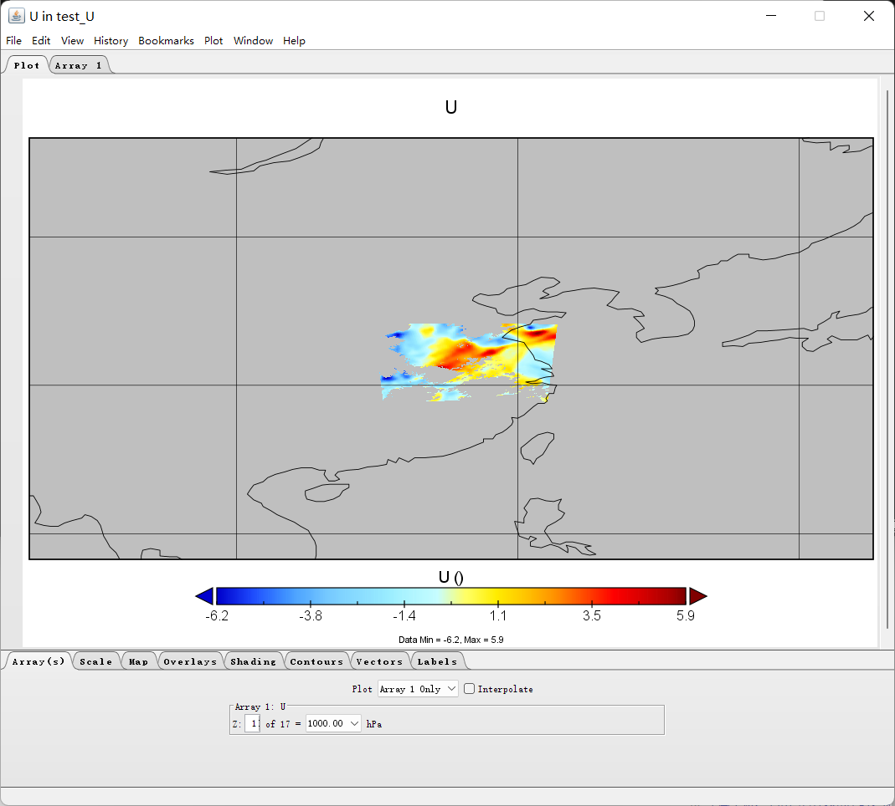

# Gridded binary with `pdef`

## Test data

This test data is an output from WRF.

The content of `wrf02d2022041312.ctl` is

```text
dset ^wrf02d2022041312.dat
options  byteswapped
undef 1.e30
title  OUTPUT FROM WRF V4.1.2 MODEL
pdef  288 288 lcc  32.318  117.203  144.500  144.500  60.00000  30.00000  117.30000   3000.000   3000.000
xdef  745 linear  112.16026   0.01351351
ydef  606 linear   28.19616   0.01351351
zdef   17 levels  
1000.00000
 975.00000
 950.00000
 925.00000
 900.00000
 850.00000
 800.00000
 750.00000
 700.00000
 650.00000
 600.00000
 550.00000
 500.00000
 400.00000
 300.00000
 200.00000
 100.00000
tdef   85 linear 12Z13APR2022      60MN      
VARS   26
XLAT           1  0  LATITUDE, SOUTH IS NEGATIVE (degree_north)
XLONG          1  0  LONGITUDE, WEST IS NEGATIVE (degree_east)
U             17  0  x-wind component (m s-1)
V             17  0  y-wind component (m s-1)
W             17  0  z-wind component (m s-1)
Q2             1  0  QV at 2 M (kg kg-1)
T2             1  0  TEMP at 2 M (K)
QVAPOR        17  0  Water vapor mixing ratio (kg kg-1)
HGT            1  0  Terrain Height (m)
TSK            1  0  SURFACE SKIN TEMPERATURE (K)
RAINC          1  0  ACCUMULATED TOTAL CUMULUS PRECIPITATION (mm)
RAINNC         1  0  ACCUMULATED TOTAL GRID SCALE PRECIPITATION (mm)
height        17  0  Model height (km)
tc            17  0  Temperature (C)
theta         17  0  Potential Temperature (K)
td            17  0  Dewpoint Temperature (C)
rh            17  0  Relative Humidity (%)
clflo          1  0  Low Cloud Fraction (%)
clfmi          1  0  Mid Cloud Fraction (%)
clfhi          1  0  High Cloud Fraction (%)
rh2            1  0  Relative Humidity at 2m (%)
u10m           1  0  Rotated wind component (m s-1)
v10m           1  0  Rotated wind component (m s-1)
slp            1  0  Sea Levelp Pressure (hPa)
dbz           17  0  Reflectivity (-)
cape          17  0  CAPE (J/kg)
ENDVARS
@ global String comment TITLE =  OUTPUT FROM WRF V4.1.2 MODEL
@ global String comment START_DATE = 2022-04-13_12:00:00
@ global String comment SIMULATION_START_DATE = 2022-04-13_12:00:00
@ global String comment WEST-EAST_GRID_DIMENSION =   289
@ global String comment SOUTH-NORTH_GRID_DIMENSION =   289
@ global String comment BOTTOM-TOP_GRID_DIMENSION =    35
@ global String comment DX =      3000.00
@ global String comment DY =      3000.00
@ global String comment AERCU_OPT =     0
@ global String comment AERCU_FCT =         1.00
@ global String comment IDEAL_CASE =     0
@ global String comment DIFF_6TH_SLOPEOPT =     0
@ global String comment AUTO_LEVELS_OPT =     2
@ global String comment DIFF_6TH_THRESH =         0.10
@ global String comment DZBOT =        50.00
@ global String comment DZSTRETCH_S =         1.30
@ global String comment DZSTRETCH_U =         1.10
@ global String comment SKEBS_ON =     0
@ global String comment SPEC_BDY_FINAL_MU =     1
@ global String comment USE_Q_DIABATIC =     0
@ global String comment GRIDTYPE = C
@ global String comment DIFF_OPT =     2
@ global String comment KM_OPT =     4
@ global String comment DAMP_OPT =     3
@ global String comment DAMPCOEF =         0.10
@ global String comment KHDIF =         0.00
@ global String comment KVDIF =         0.00
@ global String comment MP_PHYSICS =     8
@ global String comment RA_LW_PHYSICS =     1
@ global String comment RA_SW_PHYSICS =     1
@ global String comment SF_SFCLAY_PHYSICS =     1
@ global String comment SF_SURFACE_PHYSICS =     1
@ global String comment BL_PBL_PHYSICS =     1
@ global String comment CU_PHYSICS =     3
@ global String comment SF_LAKE_PHYSICS =     0
@ global String comment SURFACE_INPUT_SOURCE =     1
@ global String comment SST_UPDATE =     0
@ global String comment GRID_FDDA =     0
@ global String comment GFDDA_INTERVAL_M =     0
@ global String comment GFDDA_END_H =     0
@ global String comment GRID_SFDDA =     0
@ global String comment SGFDDA_INTERVAL_M =     0
@ global String comment SGFDDA_END_H =     0
@ global String comment HYPSOMETRIC_OPT =     2
@ global String comment USE_THETA_M =     1
@ global String comment GWD_OPT =     0
@ global String comment SF_URBAN_PHYSICS =     0
@ global String comment SF_SURFACE_MOSAIC =     0
@ global String comment SF_OCEAN_PHYSICS =     0
@ global String comment SHCU_PHYSICS =     0
@ global String comment MFSHCONV =     0
@ global String comment FEEDBACK =     1
@ global String comment SMOOTH_OPTION =     0
@ global String comment SWRAD_SCAT =         1.00
@ global String comment W_DAMPING =     0
@ global String comment DT =        18.00
@ global String comment RADT =        10.00
@ global String comment BLDT =         0.00
@ global String comment CUDT =         5.00
@ global String comment AER_OPT =     0
@ global String comment SWINT_OPT =     0
@ global String comment AER_TYPE =     1
@ global String comment AER_AOD550_OPT =     1
@ global String comment AER_ANGEXP_OPT =     1
@ global String comment AER_SSA_OPT =     1
@ global String comment AER_ASY_OPT =     1
@ global String comment AER_AOD550_VAL =         0.12
@ global String comment AER_ANGEXP_VAL =         1.30
@ global String comment AER_SSA_VAL =         0.85
@ global String comment AER_ASY_VAL =         0.90
@ global String comment MOIST_ADV_OPT =     1
@ global String comment SCALAR_ADV_OPT =     1
@ global String comment TKE_ADV_OPT =     1
@ global String comment DIFF_6TH_OPT =     0
@ global String comment DIFF_6TH_FACTOR =         0.12
@ global String comment OBS_NUDGE_OPT =     0
@ global String comment BUCKET_MM =        -1.00
@ global String comment BUCKET_J =        -1.00
@ global String comment PREC_ACC_DT =         0.00
@ global String comment ISFTCFLX =     0
@ global String comment ISHALLOW =     0
@ global String comment ISFFLX =     1
@ global String comment ICLOUD =     1
@ global String comment ICLOUD_CU =     0
@ global String comment TRACER_PBLMIX =     1
@ global String comment SCALAR_PBLMIX =     0
@ global String comment YSU_TOPDOWN_PBLMIX =     0
@ global String comment GRAV_SETTLING =     0
@ global String comment DFI_OPT =     0
@ global String comment SIMULATION_INITIALIZATION_TYPE = REAL-DATA CASE
@ global String comment WEST-EAST_PATCH_START_UNSTAG =     1
@ global String comment WEST-EAST_PATCH_END_UNSTAG =   288
@ global String comment WEST-EAST_PATCH_START_STAG =     1
@ global String comment WEST-EAST_PATCH_END_STAG =   289
@ global String comment SOUTH-NORTH_PATCH_START_UNSTAG =     1
@ global String comment SOUTH-NORTH_PATCH_END_UNSTAG =   288
@ global String comment SOUTH-NORTH_PATCH_START_STAG =     1
@ global String comment SOUTH-NORTH_PATCH_END_STAG =   289
@ global String comment BOTTOM-TOP_PATCH_START_UNSTAG =     1
@ global String comment BOTTOM-TOP_PATCH_END_UNSTAG =    34
@ global String comment BOTTOM-TOP_PATCH_START_STAG =     1
@ global String comment BOTTOM-TOP_PATCH_END_STAG =    35
@ global String comment GRID_ID =     2
@ global String comment PARENT_ID =     1
@ global String comment I_PARENT_START =    66
@ global String comment J_PARENT_START =    60
@ global String comment PARENT_GRID_RATIO =     3
@ global String comment CEN_LAT =        32.32
@ global String comment CEN_LON =       117.20
@ global String comment TRUELAT1 =        30.00
@ global String comment TRUELAT2 =        60.00
@ global String comment MOAD_CEN_LAT =        32.40
@ global String comment STAND_LON =       117.30
@ global String comment POLE_LAT =        90.00
@ global String comment POLE_LON =         0.00
@ global String comment GMT =        12.00
@ global String comment JULYR =  2022
@ global String comment JULDAY =   103
@ global String comment MAP_PROJ =     1
@ global String comment MAP_PROJ_CHAR = Lambert Conformal
@ global String comment MMINLU = MODIFIED_IGBP_MODIS_NOAH
@ global String comment NUM_LAND_CAT =    21
@ global String comment ISWATER =    17
@ global String comment ISLAKE =    21
@ global String comment ISICE =    15
@ global String comment ISURBAN =    13
@ global String comment ISOILWATER =    14
@ global String comment HYBRID_OPT =     2
@ global String comment ETAC =         0.20
```

while the data file name is like `wrf02d2022041200.dat`.

The `TDEF` in ctl file still doesn't match the data file, but that's the point of `bite_grads`, which is don't fully trust the `ctl`.

## Read

```python
from datetime import datetime

from bite_grads import GrADS

ctl_path = './test_data/wrf02d2022041312.ctl'
dat_path = './test_data/wrf02d2022041200.dat'
grads = GrADS(ctl_path)
start = datetime.strptime(dat_path[-14:-4], '%Y%m%d%H')
grads.set_time(start=start)
grads.fill_value = 1000000015047466219876688855040
ds = grads.open_dataset(dat_path)
```

The `ds` here will be

```
>>> ds
<xarray.Dataset>
Dimensions:  (t: 85, y: 288, x: 288, z: 17)
Coordinates:
  * t        (t) datetime64[ns] 2022-04-12 ... 2022-04-15T12:00:00
  * z        (z) float32 1e+03 975.0 950.0 925.0 ... 400.0 300.0 200.0 100.0
  * y        (y) float64 0.0 3e+03 6e+03 9e+03 ... 8.55e+05 8.58e+05 8.61e+05
  * x        (x) float64 0.0 3e+03 6e+03 9e+03 ... 8.55e+05 8.58e+05 8.61e+05
Data variables: (12/26)
    XLAT     (t, y, x) float32 dask.array<chunksize=(1, 288, 288), meta=MaskedArray>
    XLONG    (t, y, x) float32 dask.array<chunksize=(1, 288, 288), meta=MaskedArray>
    U        (t, z, y, x) float32 dask.array<chunksize=(1, 17, 288, 288), meta=MaskedArray>
    V        (t, z, y, x) float32 dask.array<chunksize=(1, 17, 288, 288), meta=MaskedArray>
    W        (t, z, y, x) float32 dask.array<chunksize=(1, 17, 288, 288), meta=MaskedArray>
    Q2       (t, y, x) float32 dask.array<chunksize=(1, 288, 288), meta=MaskedArray>
    ...       ...
    rh2      (t, y, x) float32 dask.array<chunksize=(1, 288, 288), meta=MaskedArray>
    u10m     (t, y, x) float32 dask.array<chunksize=(1, 288, 288), meta=MaskedArray>
    v10m     (t, y, x) float32 dask.array<chunksize=(1, 288, 288), meta=MaskedArray>
    slp      (t, y, x) float32 dask.array<chunksize=(1, 288, 288), meta=MaskedArray>
    dbz      (t, z, y, x) float32 dask.array<chunksize=(1, 17, 288, 288), meta=MaskedArray>
    cape     (t, z, y, x) float32 dask.array<chunksize=(1, 17, 288, 288), meta=MaskedArray>
```

Through `grads.set_time(time)`, the `ds` carries the correct `t` coordinate.

## `need_global_attrs`

Except `need_var_attrs` and `need_crs` shown in the fist example, you can get global attributes by passing `need_global_attrs=True`  to `grads.open_dataset`:

```
>>> ds = grads.open_dataset(dat_path, need_crs=True, need_var_attrs=True, need_global_attrs=True)
>>> ds
<xarray.Dataset>
Dimensions:  (t: 85, y: 288, x: 288, z: 17)
Coordinates:
  * t        (t) datetime64[ns] 2022-04-12 ... 2022-04-15T12:00:00
  * z        (z) float32 1e+03 975.0 950.0 925.0 ... 400.0 300.0 200.0 100.0
  * y        (y) float64 0.0 3e+03 6e+03 9e+03 ... 8.55e+05 8.58e+05 8.61e+05
  * x        (x) float64 0.0 3e+03 6e+03 9e+03 ... 8.55e+05 8.58e+05 8.61e+05
    crs      float64 nan
Data variables: (12/26)
    XLAT     (t, y, x) float32 dask.array<chunksize=(1, 288, 288), meta=MaskedArray>
    XLONG    (t, y, x) float32 dask.array<chunksize=(1, 288, 288), meta=MaskedArray>
    U        (t, z, y, x) float32 dask.array<chunksize=(1, 17, 288, 288), meta=MaskedArray>
    V        (t, z, y, x) float32 dask.array<chunksize=(1, 17, 288, 288), meta=MaskedArray>
    W        (t, z, y, x) float32 dask.array<chunksize=(1, 17, 288, 288), meta=MaskedArray>
    Q2       (t, y, x) float32 dask.array<chunksize=(1, 288, 288), meta=MaskedArray>
    ...       ...
    rh2      (t, y, x) float32 dask.array<chunksize=(1, 288, 288), meta=MaskedArray>
    u10m     (t, y, x) float32 dask.array<chunksize=(1, 288, 288), meta=MaskedArray>
    v10m     (t, y, x) float32 dask.array<chunksize=(1, 288, 288), meta=MaskedArray>
    slp      (t, y, x) float32 dask.array<chunksize=(1, 288, 288), meta=MaskedArray>
    dbz      (t, z, y, x) float32 dask.array<chunksize=(1, 17, 288, 288), meta=MaskedArray>
    cape     (t, z, y, x) float32 dask.array<chunksize=(1, 17, 288, 288), meta=MaskedArray>
Attributes: (12/129)
    TITLE:                           OUTPUT FROM WRF V4.1.2 MODEL
    START_DATE:                      2022-04-13_12:00:00
    SIMULATION_START_DATE:           2022-04-13_12:00:00
    WEST-EAST_GRID_DIMENSION:        289
    SOUTH-NORTH_GRID_DIMENSION:      289
    BOTTOM-TOP_GRID_DIMENSION:       35
    ...                              ...
    ISLAKE:                          21
    ISICE:                           15
    ISURBAN:                         13
    ISOILWATER:                      14
    HYBRID_OPT:                      2
    ETAC:                            0.2

>>> ds['x']
<xarray.DataArray 'x' (x: 288)>
array([     0.,   3000.,   6000., ..., 855000., 858000., 861000.])
Coordinates:
  * x        (x) float64 0.0 3e+03 6e+03 9e+03 ... 8.55e+05 8.58e+05 8.61e+05
    crs      float64 nan
Attributes:
    units:          m
    long_name:      x coordinate of projection
    standard_name:  projection_x_coordinate

>>> ds['crs']
<xarray.DataArray 'crs' ()>
array(nan)
Coordinates:
    crs      float64 nan
Attributes:
    crs_wkt:                        PROJCRS["unknown",BASEGEOGCRS["unknown",D...
    semi_major_axis:                6370000.0
    semi_minor_axis:                6370000.0
    inverse_flattening:             0.0
    reference_ellipsoid_name:       unknown
    longitude_of_prime_meridian:    0.0
    prime_meridian_name:            Greenwich
    geographic_crs_name:            unknown
    horizontal_datum_name:          unknown
    projected_crs_name:             unknown
    grid_mapping_name:              lambert_conformal_conic
    standard_parallel:              (60.0, 30.0)
    latitude_of_projection_origin:  32.4
    longitude_of_central_meridian:  117.30000000000001
    false_easting:                  439528.6984313187
    false_northing:                 439524.70233380556
    earth_radius:                   6370000.0
```

## Save to nc file

Remember to `.compute()` before `.to_netcdf()`, otherwise the `fill_value` won't work.

```python
ds['U'].isel(t=0).compute().to_netcdf('./test_data/test_U.nc')
```

If `need_crs=True`, the saved nc file can be opened by panoply providing `Georeferenced Longitude-Latitue` visualization.



