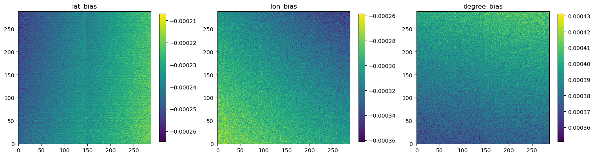

# Check the CRS

If your pre-projected data has longitude and latitude for each point like WRF output, you can check the CRS generated by `GrADS` like:

```python
import numpy as np
from pyproj import Transformer
import matplotlib.pyplot as plt

from bite_grads.grads import GrADS

grads = GrADS('./test_data/wrf02d2022041312.ctl')
ds = grads.open_dataset('./test_data/wrf02d2022041200.dat')
x, y = np.meshgrid(ds['x'], ds['y'])
prj2geo = Transformer.from_crs(grads.crs, grads.crs.geodetic_crs, always_xy=True)
lon_calc, lat_calc = prj2geo.transform(x, y)
lon_grads = ds['XLONG'][0].values
lat_grads = ds['XLAT'][0].values

lat_bias = lat_calc - lat_grads
lon_bias = lon_calc - lon_grads
degree_bias = ((lon_bias)**2 + (lat_bias)**2)**0.5

fig, axes = plt.subplots(1, 3, figsize=(16, 5))
fig.subplots_adjust(left=0.05, right=0.95)
im = axes[0].imshow(lat_bias, origin='lower')
fig.colorbar(im, ax=axes[0], shrink=0.85)
axes[0].set_title('lat_bias')

im = axes[1].imshow(lon_bias, origin='lower')
fig.colorbar(im, ax=axes[1], shrink=0.85)
axes[1].set_title('lon_bias')

im = axes[2].imshow(degree_bias, origin='lower')
fig.colorbar(im, ax=axes[2], shrink=0.85)
axes[2].set_title('degree_bias')
plt.show()
```

